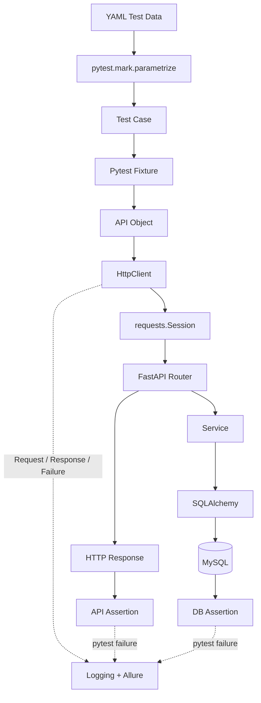

# Pytest API Automation Framework

基于 Python、Pytest 和 Requests 构建的接口自动化测试框架，并自建 FastAPI + MySQL 业务系统作为被测服务。

项目由两个可以独立安装、配套运行的子项目组成：

| 子项目 | 职责 | 已实现能力 |
| --- | --- | --- |
| `api-automation-framework` | 发送真实 HTTP 请求并验证接口和数据库结果 | Pytest、`requests.Session`、HttpClient、API Object、Fixture、YAML 数据驱动、Allure、MySQL 断言 |
| `api-test-server` | 提供稳定、可控的被测业务 | FastAPI、JWT 鉴权、用户、商品、订单、MySQL 持久化、订单状态流转 |

项目早期使用公开 API 验证请求封装和测试分层。公开 Mock API 无法稳定覆盖数据持久化、JWT、数据库状态、订单流转、数据清理和并发库存，因此后续加入 FastAPI + MySQL 服务，形成从 HTTP 请求到数据库验证的完整测试环境。

## 项目亮点与技术栈

项目采用 Test → Fixture → API Object → HttpClient → `requests.Session` 分层，使用 YAML、`pytest.mark.parametrize` 和 Faker 管理动态测试数据，通过独立 MySQL 查询验证关键业务状态。当前已经接入 E2E、pytest-xdist、Logging、Allure、GitHub Actions 和脱敏后的 CI Artifact。

技术栈包括 Python 3.11、Pytest、Requests、FastAPI、Pydantic、SQLAlchemy、MySQL 8.4、JWT、YAML、Faker、Allure、pytest-xdist 和 GitHub Actions。

## 当前已验证结果

以下结果来自 Python 3.11 与 MySQL 8.4.5 隔离环境中的最新验收：

| 检查项 | 结果 |
| --- | --- |
| FastAPI Server Tests | 32 passed |
| Framework Unit Tests | 54 passed |
| Smoke Tests | 5 passed，92 deselected |
| Regression Tests | 43 passed，54 deselected |
| Automation Full Test Suite | 97 passed |
| 4-worker pytest-xdist Full Suite | 97 passed |
| API + DB Assertion | PASS |
| Concurrent Stock Protection | PASS，两个请求分别返回 201 和 409，剩余库存为 0 |
| Allure Results | Supported，已验证结果文件和 Request/Response 附件可生成 |
| GitHub Actions | PASS，Run ID `33896367458` |

`97 passed` 表示 Pytest 参数化展开后的 test item 数量，不是接口数量，也不代表 100% 代码覆盖率。Smoke 属于 Full 测试集的一部分，不重复累计。

## System Architecture



测试框架通过 HTTP 使用被测系统，不导入服务内部业务代码。数据库客户端只读取关键持久化结果，API 断言和数据库断言从两个观察面验证同一业务状态。

## Framework Architecture

### Test Layer

`tests/` 描述要验证的业务场景、执行步骤和断言。测试从 Fixture 获取依赖，通过 API Object 发起业务调用，不直接使用 Requests，也不在用例中重复拼接大量 URL。

### Fixture Layer

根目录的 `conftest.py` 管理依赖和生命周期，包括配置、公共 Client、认证 Client、API Object、动态用户、JWT、数据库连接以及测试数据清理。共享且无状态的资源采用 session scope，记录单条用例资源的 `test_data` 采用 function scope。

### API Object Layer

`AuthApi`、`UserApi`、`ProductApi` 和 `OrderApi` 描述业务接口如何调用。路径、HTTP Method 和请求体组装留在这一层，业务断言仍由测试负责。

### HttpClient Layer

`HttpClient` 基于 `requests.Session`，统一处理 Base URL、HTTP Method、Headers、Cookies、Timeout、Params、JSON、Form Data、请求响应日志和 Allure 附件。网络异常会记录耗时、异常类型和脱敏后的错误内容。

HttpClient 只提供 HTTP 技术能力，不判断登录、库存、订单状态等业务规则。

## Project Structure

```text
pytest-api-automation-project/
├── .github/
│   └── workflows/
│       └── api-test.yml
├── api-automation-framework/
│   ├── api/
│   │   ├── auth_api.py
│   │   ├── health_api.py
│   │   ├── order_api.py
│   │   ├── product_api.py
│   │   └── user_api.py
│   ├── common/
│   │   ├── database.py
│   │   ├── http_client.py
│   │   └── logger.py
│   ├── config/
│   │   ├── config.py
│   │   └── config.yaml
│   ├── data/
│   │   ├── auth.yaml
│   │   ├── order.yaml
│   │   ├── product.yaml
│   │   └── security.yaml
│   ├── tests/
│   ├── utils/
│   │   ├── data_factory.py
│   │   ├── data_lifecycle.py
│   │   └── yaml_util.py
│   ├── conftest.py
│   ├── pytest.ini
│   └── requirements.txt
├── api-test-server/
│   ├── app/
│   │   ├── api/
│   │   ├── core/
│   │   ├── database/
│   │   ├── models/
│   │   ├── schemas/
│   │   ├── services/
│   │   └── main.py
│   ├── tests/
│   └── requirements.txt
└── README.md
```

生成目录如 `.venv`、`__pycache__`、`.pytest_cache`、`logs`、`reports` 和 `allure-results` 未列入结构图，也不会提交到 Git。

## Core Test Scenarios

### Authentication

认证主链路为 `Register → Login → JWT → GET /api/users/me`。用例覆盖注册和正常登录、错误密码、不存在用户、无 Token、错误 Token，以及受保护资源的认证要求。服务使用 Argon2 保存密码哈希，JWT 从登录响应动态获取。

### Product

商品测试覆盖 Create、Query、List、Update、Delete、非法价格、零库存边界、负库存、资源不存在和安全输入。

已有订单引用商品时，服务主动拒绝删除并返回 HTTP 409：

```json
{
  "detail": "Product cannot be deleted because it has existing orders"
}
```

服务测试同时确认冲突发生后 Product 和 Order 仍然存在；自动化框架还通过真实注册、登录、创建商品、创建订单和删除请求覆盖这条 Regression Case。

### Order

订单创建会锁定商品记录、检查商品状态和库存、计算总金额并扣减库存：

```text
Create Order
    ↓
Stock Decreases
    ↓
Pay Order
    ↓
Status = PAID
```

取消 `CREATED` 订单会恢复库存并把状态改为 `CANCELLED`。异常场景包括库存不足、商品不存在、商品不可用、重复支付、支付已取消订单、取消已支付订单、非法数量和订单越权访问。

## E2E Workflow

```text
Register User
    ↓
Login
    ↓
Get JWT
    ↓
GET /api/users/me
    ↓
Create Product
    ↓
Create Order
    ↓
Get Order ID
    ↓
Pay Order
    ↓
Query Order
    ↓
API Assertion
    ↓
MySQL Assertion
    ↓
Cleanup
```

Token、User ID、Product ID 和 Order ID 都来自当前用例的真实接口响应。测试不依赖固定业务 ID，也不依赖其他 Case 的执行结果或执行顺序。

## Data Driven Testing

框架使用 YAML 保存输入和预期结果，再由 `pytest.mark.parametrize` 让一个测试函数执行多条 Case。当前数据文件以这些字段为主：

| 字段 | 用途 |
| --- | --- |
| `case_id` | 唯一标识，用作参数化测试 ID |
| `title` | 描述业务场景，并用于 Allure 标题 |
| `category` | 区分 normal、boundary 和 exception |
| `request` | 请求数据 |
| `expected_status` | 预期 HTTP 状态或业务状态 |
| `expected_detail` 等预期字段 | 描述响应正文中的错误信息、订单状态或金额 |

不同业务的响应结构并不相同，因此当前 YAML 使用 `expected_detail`、`expected_order_status`、`expected_total_amount` 等具体字段表达预期正文。测试逻辑负责执行步骤，YAML 负责正常、异常和边界输入，失败报告会显示 Case ID。

## Test Data Lifecycle

`DataFactory` 使用 Faker 生成唯一用户名、邮箱和商品名，接口返回的 ID 会登记到 function scope 的 `TestDataManager`。每条用例结束后按外键关系清理：

```text
Order → Product → User
```

订单和用户目前没有业务删除接口，因此订单和用户使用参数化 SQL 清理，商品优先通过业务 API 删除。清理器会继续尝试独立资源，并在结束时汇总抛出清理错误，不会静默忽略失败。

动态数据减少历史记录冲突，让测试能够重复运行，也避免 pytest-xdist worker 共用固定业务 ID。

## Database Validation

E2E 支付用例在 API 断言后查询 MySQL：

```text
POST /api/orders/{id}/pay
    ↓
API Response: status = PAID
    ↓
SELECT status FROM orders WHERE id = %s
    ↓
Database: status = PAID
```

SQL 使用参数化查询。数据库断言只检查订单状态等关键持久化结果，不重复验证每个响应字段，避免测试与内部表结构过度耦合。

## Concurrency Test

订单服务在读取待扣减商品时调用 SQLAlchemy 的 `with_for_update()`。数据库事务会锁定对应商品行，另一个请求需要等待前一个事务提交后再读取库存。

最新独立验收使用库存为 1 的商品并发发送两个创建订单请求，结果为：

```text
HTTP status: [201, 409]
remaining stock: 0
order count: 1
```

该场景验证并发扣减时的库存一致性，目标是防止两个请求同时消耗同一份库存，不代表系统已经完成大规模并发或性能测试。

## Logging & Allure

HttpClient 为每次调用记录 Method、URL、Headers、Cookies、Params、Request Body、Response Status、Response Body 和 Elapsed Time。发生 Requests 异常时还会记录异常类型和错误信息。

日志和附件会递归脱敏以下字段及其常见变体：

- `Authorization`
- Bearer Token 与典型三段式 JWT
- `password`、`passwd`
- `token`、`access_token`、`refresh_token`
- `api_key`、`secret`
- `Cookie` 与 `Set-Cookie`

FastAPI / Pydantic 返回 422 validation error 时，脱敏器会根据 `loc` 指向的敏感字段遮蔽同一错误对象中的 `input`，非敏感字段仍保留诊断值。HttpClient 处理的是日志和 Allure 使用的诊断副本，不修改实际 HTTP 请求、响应或测试断言。

日志同时输出到控制台和文件。串行测试写入 `logs/api_test.log`，pytest-xdist worker 分别写入 `api_test_gw0.log`、`api_test_gw1.log` 等文件，避免多个进程竞争同一个日志句柄。

Allure Results 包含 Epic、Feature、Story、Step、HTTP Request、HTTP Response 和传输失败诊断。Pytest 断言失败由 `allure-pytest` 写入测试结果。CI 会再次处理 Allure JSON、文本附件以及 `statusDetails.message` / `statusDetails.trace`，只上传脱敏后的暂存副本。生成原始结果不依赖 Allure CLI，HTML 报告是可选步骤。

## Test Classification

`pytest.ini` 使用 strict markers 注册以下分类：

| Marker | 范围 |
| --- | --- |
| `smoke` | 健康检查、登录态、当前用户、创建商品和创建订单等核心检查 |
| `regression` | 完整接口行为回归集合 |
| `auth` | 注册、登录和鉴权 |
| `user` | 当前用户接口 |
| `product` | 商品接口 |
| `order` | 订单接口与状态流转 |
| `e2e` | 跨接口业务链路 |
| `db` | 数据库客户端或 API + DB 断言 |

从 `api-automation-framework/` 运行：

```powershell
python -m pytest -v --env=test -m smoke
python -m pytest -v --env=test -m regression
python -m pytest -v --env=test -m "smoke or e2e"
python -m pytest -v --env=test -m auth
python -m pytest -v --env=test -m product
python -m pytest -v --env=test -m order
python -m pytest -v --env=test -m db
python -m pytest -v --env=test -n 4
```

并行执行需要显式传入 `-n`，默认仍采用串行，便于复现和调试失败。项目没有启用自动重试。

## Environment Configuration

`api-automation-framework/config/config.yaml` 定义 `test` 和 `pre` 两套 Base URL 与 Timeout。环境选择优先级为：

```text
--env → TEST_ENV → test
```

`API_BASE_URL` 和 `API_TIMEOUT` 可以覆盖 YAML 中当前环境的值。MySQL 配置从环境变量或 `.env` 读取：`DB_HOST`、`DB_PORT`、`DB_USER`、`DB_PASSWORD`、`DB_NAME`，可选 `DB_CONNECT_TIMEOUT`。

FastAPI 服务另外读取 `JWT_SECRET_KEY`、`JWT_ALGORITHM` 和 `ACCESS_TOKEN_EXPIRE_MINUTES`。两个子项目都提供 `.env.example`，本地 `.env` 已加入 `.gitignore`。测试使用隔离数据库 `api_test`，不应连接生产库。

## Quick Start

### Requirements

- Python 3.11
- MySQL 8.x，可使用本地实例或独立测试容器
- 可选：Allure CLI，仅在需要生成 HTML 报告时安装

### Clone

```bash
git clone https://github.com/gongyang0076-debug/requests.git
cd requests
```

### Prepare MySQL

在本地 MySQL 创建隔离数据库和测试账号。密码只保存在本机环境变量或 `.env` 中：

```sql
CREATE DATABASE api_test CHARACTER SET utf8mb4 COLLATE utf8mb4_unicode_ci;
CREATE USER 'api_test_user'@'%' IDENTIFIED BY '<local-password>';
GRANT ALL PRIVILEGES ON api_test.* TO 'api_test_user'@'%';
FLUSH PRIVILEGES;
```

如果测试账号已经存在，只需确认它可以访问 `api_test`。服务启动时通过 SQLAlchemy `create_all` 创建当前模型对应的表。

### Test Server Setup

进入服务目录并创建独立虚拟环境：

```powershell
cd api-test-server
py -3.11 -m venv .venv
.\.venv\Scripts\Activate.ps1
python -m pip install -r requirements.txt
Copy-Item .env.example .env
```

macOS 或 Linux 可使用：

```bash
cd api-test-server
python3.11 -m venv .venv
source .venv/bin/activate
python -m pip install -r requirements.txt
cp .env.example .env
```

编辑 `.env`，填写隔离 MySQL 的连接信息和至少 32 个字符的 JWT 签名密钥。不要提交该文件。

运行服务测试：

```powershell
python -m pytest -v
```

启动服务：

```powershell
python -m uvicorn app.main:app --reload
```

默认配置下可访问：

```text
GET http://127.0.0.1:8000/health
GET http://127.0.0.1:8000/health/db
```

### Automation Framework Setup

保留测试服务运行，在另一个终端进入自动化框架目录：

```powershell
cd api-automation-framework
py -3.11 -m venv .venv
.\.venv\Scripts\Activate.ps1
python -m pip install -r requirements.txt
Copy-Item .env.example .env
```

macOS 或 Linux 将激活和复制命令替换为：

```bash
source .venv/bin/activate
cp .env.example .env
```

框架 `.env` 需要指向正在运行的 FastAPI 服务和同一个隔离 MySQL 数据库。示例文件只包含占位值。

### Run Automation Tests

从 `api-automation-framework/` 执行：

```powershell
# Smoke
python -m pytest -v --env=test -m smoke

# Regression
python -m pytest -v --env=test -m regression

# Full suite
python -m pytest -v --env=test

# Four workers
python -m pytest -v --env=test -n 4

# Allure raw results
python -m pytest -v --env=test --alluredir=allure-results --clean-alluredir
```

如果本机安装了 Allure CLI，可以再生成 HTML：

```powershell
allure generate allure-results -o reports/allure-report --clean
allure open reports/allure-report
```

## GitHub Actions

仓库包含 `.github/workflows/api-test.yml`，触发条件为 `main` 分支 Push、Pull Request 和手动运行。当前工作流已经在 GitHub-hosted Ubuntu Runner 上完成远端验收：

```text
MySQL 8.4.5 初始化 → Checkout → Python 3.11 → 安装依赖
→ DB precheck → Server Tests → 启动 FastAPI → Health Check
→ Smoke → Full → Stop Server → Sanitize → Security Gate
→ Upload Sanitized Artifact
```

CI 通过 Repository Secrets 注入隔离测试环境的数据库和 JWT 配置，不读取或上传本地 `.env`。测试输出先经过 stream redactor 再进入控制台和日志，Bash `pipefail` 保留 pytest、sanitizer 和 `tee` 的非零退出码。Artifact 构建使用明确的文本文件白名单；sanitizer 失败会关闭上传门禁，不会回退上传原始日志或 Allure Results。Smoke 与 Full 使用独立的 Allure Results 目录。

最近一次已复核的交付基线为 GitHub Actions Run `33896367458`：Server 32 passed、Smoke 5 passed、Full 97 passed。下载的安全 Artifact 包含 603 个文件，其中 `sanitized_files=602`、`skipped_files=[]`；短密码和长密码的真实 422 响应均显示 `input: "[REDACTED]"`，未发现已知敏感值残留。

这是当前交付基线的工程验收结果，不代表生产级安全认证。

## Design Decisions

### Why requests.Session?

Session 可以复用底层连接，并集中保存共享 Headers、Cookies 和登录态。认证 Client 在 Session Header 中注入 Bearer Token，测试不用在每次调用时重复传递。

### Why HttpClient?

HttpClient 统一 Base URL、超时、HTTP 方法、请求参数、日志、脱敏和 Allure 附件。新增 API 时可以复用这些技术能力，网络层也能单独测试。

### Why API Object?

API Object 把业务接口名称映射到路径和 HTTP Method。测试表达“获取当前用户”或“支付订单”，不用了解具体 URL 拼接和请求细节。

### Why Fixture?

Fixture 负责创建、共享和关闭 Client、数据库连接、API Object 与认证状态。Scope 明确后，共享资源只初始化一次，每条用例的数据仍保持独立。

### Why YAML + Parametrize?

YAML 保存输入和预期，参数化负责把多条数据转换为独立测试实例。新增边界数据时通常无需复制整个测试函数，失败结果仍能通过 Case ID 定位。

### Why API + DB Assertion?

API 响应正确不代表数据库一定完成了持久化。订单支付同时检查响应和 `orders.status`，能够发现只修改响应、事务未提交或写库错误。数据库断言只放在关键链路，减少测试与表结构的耦合。

### Why Dynamic Data?

固定用户名和业务 ID 会受到历史数据、执行顺序和并行 worker 的影响。Faker 与接口响应生成当前 Case 的数据，Teardown 再按依赖关系删除，测试可以重复执行。

### Why MySQL Row Lock?

创建订单需要读取库存并扣减。`with_for_update()` 让同一商品的并发事务串行检查库存，后到的请求读取前一个事务提交后的值，从而避免超卖。

## Known Limitations

- 这是测试开发学习与工程展示项目，不是生产电商系统。
- 商品列表暂未实现分页。
- 数据库 Schema 通过 SQLAlchemy `create_all` 创建，尚未接入 Alembic Migration。
- CI 使用隔离的测试环境 MySQL，没有连接生产数据库。
- 并发验收关注库存一致性，尚未进行大型压力或性能测试。
- 当前没有分布式事务、完整 Token Refresh 或生产级监控体系。

## Future Improvements

- 为列表接口增加 Pagination。
- 使用 Alembic 管理数据库版本迁移。
- 增加更多 API Contract Validation。
- 增加独立的 Performance Testing。
- 扩展 Python 和 MySQL 的 CI Matrix。
- 提供统一的 Docker Compose 本地环境。

这些项目均为后续方向，当前仓库没有实现。

## What This Project Demonstrates

- API 自动化框架分层设计
- Pytest Fixture 与登录态管理
- YAML 数据驱动和参数化执行
- JWT 认证及异常场景测试
- API 与 MySQL 关键状态一致性验证
- 动态测试数据和外键安全清理
- 并发库存一致性验证
- 日志脱敏与 Allure 可观测性
- Smoke、Regression、E2E 和 DB 测试分类
- GitHub Actions 工作流设计
